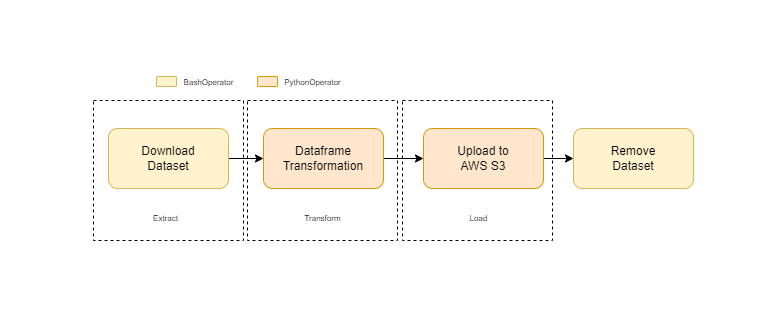

# Orchestration of the data pipeline using Airflow

## Introduction

With the goal of ensure an automated working flow, and a visual graph it was decided to build an [Airflow](https://airflow.apache.org/) DAG.
This DAG has all the functionalities of the script developed in the first step. 

The program Airflow was set to run inside Docker container in a local way (my laptop). 

However, since it was created a Docker image then the DAG, Python code and settings (requirements) can be extrapolated for other laptop or virtual machine.

## Reproducibility

**Pre requisites**

To be able to run the solution provided it is necessary to have:
- [Docker Desktop installed](https://www.docker.com/products/docker-desktop/)
- Access to internet. 
- [AWS access key and secret key for the AWS account you want to load the data.](https://docs.aws.amazon.com/general/latest/gr/aws-sec-cred-types.html)

Airflow variables:
- COUNTRY: the name of country you want to filter. Has to be in English;
- BUCKET: the AWS S3 bucket where we want to insert the JSON file;
- AWS_ACCESS_KEY : AWS Access key to be able to upload the JSON File;
- AWS_SECRET_KEY : AWS Secret key to be able to upload the JSON File;

**Docker steps**

To run Airflow with Docker and Docker-Compose the following steps were made and can be reproduced:
1. [Development of all the files needed to run Airflow inside a Docker container.](./Airflow/setup_docker.md) 
   This step can be skipped if the repository files are copied locally;
2. [Set the Docker-Compose to build and to run.](./Airflow/README.md)

## Data workflow design

As mentioned before, the process is an ETL flow therefore the high level architecture is as following:

## Final Airflow DAG

The Python file with the final DAG to automate the challenge requirements is presented in [here](./Airflow/dags/hash_code.py) 

[Back to main](https://github.com/guoliveira/hashcode_challenge)
